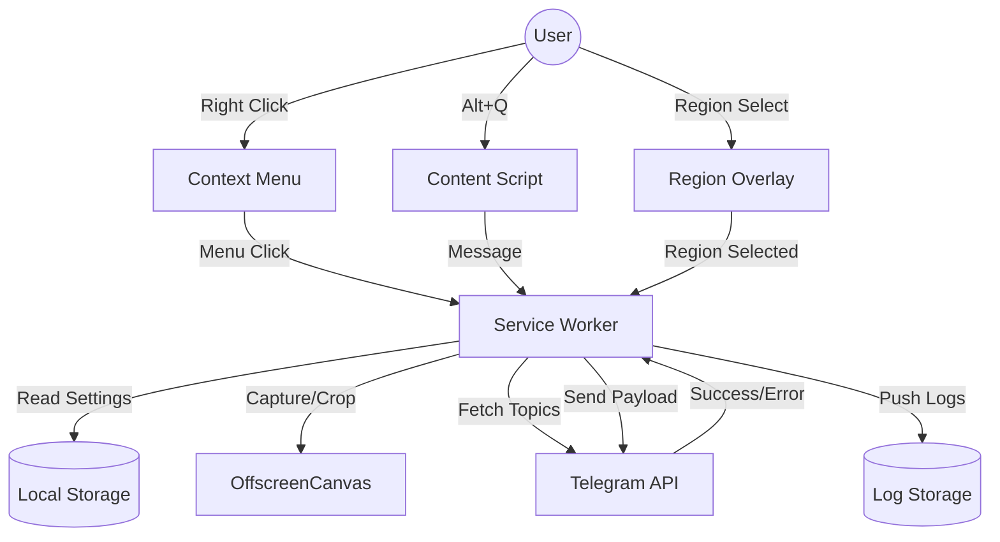

# SwiftShift Architecture & Data Flow

## 🏗️ High-Level Component Design

The extension follows the standard **Manifest V3** architecture with a heavy reliance on the Service Worker (Background Script) for API communication, large file handling, and intricate caching logic.



## 🧩 Components

### 1. Popup UI (Settings & Onboarding)
- **Tech:** React + TailwindCSS.
- **Features:** 
    - **Profile Management:** Save multiple "Profiles" (Bot Token + Chat ID sets).
    - **Token Security:** Masked input field (Start/End visible) with toggle eye icon.
    - **Refresh Button:** To manually update cached Topics/Channels.
    - **Guide Link:** Embedded help or link to external guide.

### 2. Service Worker (Background.ts)
- **Role:** The Orchestrator.
- **Responsibilities:**
    - **Cache Manager:** Store and retrieve Topic lists. Manage "Last Used" sorting.
    - **Media Router (SmartSend):** 
        - Routes `.gif` to `sendAnimation`.
        - Routes `.svg` to `sendDocument`.
        - Detects Google Maps `@lat,lon` and routes to `sendLocation`.
    - **Capture Engine:** 
        - `captureVisibleTab` for full/visible screenshots.
        - `OffscreenCanvas` for cropping user-selected regions.
    - **Migration Engine:** Automatic v3 (flat) to v4 (profile-based) storage conversion.
    - **Context Menu Builder:** Dynamic rebuilding based on "Top 3 + More" logic.

### 3. Content Script (Index.tsx)
- **Role:** Interaction Layer.
- **Responsibilities:**
    - **Alt+Q Listener.**
    - **Region Capture UI:** Translucent overlay with crosshair for rectangle selection.
    - **Metadata Extraction:** Extract coordinates from Maps URLs.

## 💾 Data Storage Schema (`chrome.storage.local`)

```typescript
interface StorageSchema {
  activeProfileId: string;
  profiles: Record<string, UserProfile>;
  recentTargets: string[]; // List of IDs sorted by recency
}

interface UserProfile {
  id: string;
  name: string; // e.g. "My Private Bot"
  botToken: string; // Stored securely
  chatId: string;
  targets: TelegramTarget[]; // Cached list of topics
  lastSynced: number; // Timestamp
}

interface TelegramTarget {
  id: string; // Chat ID or Topic ID
  name: string;
  type: 'channel' | 'group' | 'topic';
}
```

## 🔒 Security & Privacy
- **Host Permissions:** `https://api.telegram.org/*` - Required for API.
- **Data Privacy:** Tokens stored in `chrome.storage.local`.
- **Masking:** Tokens are never displayed in plain text in the UI after entry without explicit user action.
